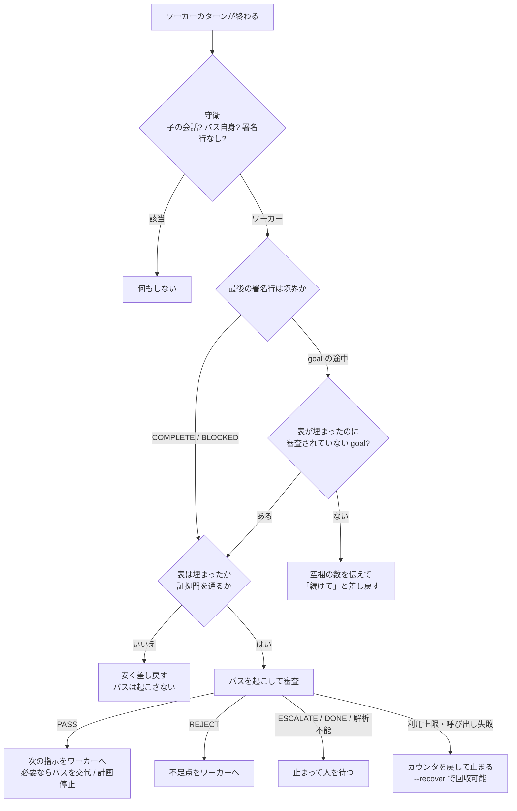

# 長命バス方式：無人で goal を回す

> **English summary** — A method for running a long, multi-goal agent task with nobody at the keyboard.
> A *worker* session executes goals and records a verdict with quoted evidence for every acceptance
> criterion in PROGRESS.md. A long-lived *bus* session — the one that wrote the whole goal pack — is
> woken only at goal boundaries to review and to write the next goal's instructions. Two Claude Code
> Stop hooks connect them: an evidence gate that bounces obviously unverified verdicts for free, and a
> relay that drives turns from the file, wakes the bus, parses its verdict, enforces caps and rotates
> the bus when its context fills. Every anomaly stops and waits for a human. One gap is left open on
> purpose: when the relay stops, nothing tells anyone.

## 1. 何のための方式か

AI エージェントに大きな仕事を一度に渡すと、たいてい四つの形で壊れます。コンテキストが失われる、判断の基準がずれていく、検証できない「完了しました」が返ってくる、間違いに気づいたときの手戻りが大きい。どれもエラーにはならず、「できました」と報告されるのが厄介です。

仕事を goal に分け、goal ごとに受け入れ条件（AC）を表にするところまでは、多くの人がやっています。残る問題は二つです。

- **完了を誰が判定するか。** Claude Code の `/goal` の評価者は小さなモデルで、ツールを呼ばず会話だけを見ます。判定表のファイルは読めず、捏造された引用も見抜けません。
- **goal の間を誰がつなぐか。** 次の goal の指示は、前の goal で分かったことを踏まえて書く必要があります。新しく立ち上げた会話には書けません。goal 包を書き、全体を知っている会話だけが書けます。

この方式は、完了の判定をファイルに移し、goal の間のつなぎを「長命のバス」に任せます。人は張り付かず、非同期に関わります。

## 2. 役割

| 役割 | 責任 |
|---|---|
| **ワーカー** | goal-brief を唯一の入口にして goal を実行する。AC ごとに判定と引用つきの証拠を PROGRESS.md に書き（書いてから報告する）、ターンの最後に必ず進捗行か境界行を出す。この行はワーカーであることの署名も兼ねる。 |
| **バス** | goal 包を書いた長命の会話。goal の境界でだけ起こされ、BUS-PROTOCOL に従って審査し、応答の最後に機械が読める裁決（PASS / REJECT / ESCALATE / DONE）と次の指示を書く。迷ったら自分で確かめに行き、毎回長期メモ（BUS-MEMORY）を更新する。 |
| **hook（2 つ）** | 証拠門は低レベルの問題（空の証拠、引用なし、曖昧な言い回し、形の崩れた FAIL）を数秒で差し戻す。リレーは goal の途中を駆動し、境界でバスを起こし、裁決を解析し、上限を守り、コンテキストが埋まったバスを交代させる。異常はすべて止まって人を待つ。 |
| **人** | ブランチを作る。閂（有効化フラグ）を立て、外す。ESCALATE に答える。利用上限で止まった後に「続けて」と言う。goal の境界で commit する。審査の手抜きを抜き取りで監査する（機械では防げない唯一の穴）。 |

## 3. 流れ

大事なのは、安いチェックを先に置くことです。証拠門は数秒で終わり、費用もかかりません。バスの審査は数分と数ドルかかります。だからバスには、引用が質問に答えているか、観察が AC を証明しているか、前の goal と矛盾していないか、といった高レベルの問いだけが届きます。

## 4. 使うべきとき、使うべきでないとき

次の条件がすべてそろうときにだけ使う価値があります（仕組みは軽くありません）。

- 複数のチケット・複数日にまたがる規模で、goal がいくつもあり、AC が数十ある。
- すべての AC を、引用できる観察（HTTP の断片、DB の出力、画面の文言、成果物の指紋）で PASS / FAIL / BLOCKED / DEFERRED に判定できる。
- bypassPermissions と deny リストで動かしてよい、信頼できる環境である。
- 人が非同期に関わることを受け入れられる。

探索的な設計作業（AC が書けない）、goal の途中で人の判断が頻繁に要る作業、外部の状態を定期的に見に行く作業（それは `/loop` の仕事です）、小さな修正一つには向きません。

同じような基準で、仕様駆動開発（SDD）との使い分けも決めています。単一のチケットで難所が人の裁定にあるなら SDD、複数のチケットを AC の表でリレーできるならこの方式、目標ははっきりしているが未知の部分が実行しないと分からないならどちらも使いません。その場合も、凍結した裁定と項目ごとの判定台帳という規律だけは借ります。

## 5. 二つの形態

| | ローカル（Stop hook によるリレー） | リモートホスト |
|---|---|---|
| 形 | この文書のすべて | (a) 駆動役のいない単体のワーカー、または (b) リレー一式をホストに載せる |
| 生き延びるもの | 端末を閉じること | 手元の PC の電源断 |
| 救出 | ワーカーに直接話しかける | `start-worker.sh --resume <id> "<修正指示>"` |

**リモートの (a) では、ターンの終わりがプロセスの終わりです。** 呼び戻す仕組みは何もありません。そのため指示には「待つときはすべて、このターンの中で 1 回の同期待ちで待つ。二つの正しい出口以外でターンを終えない」と書きます。結果をファイルに残す規律が守られていれば、`--resume` で文脈ごと続きから再開できます。

**リモートの (b)** は、発車前の関門を省略できません。ホストで gawk か mawk かを確かめて両方の自己テストを通し、すべてのマシン・すべての作業ツリーで占有を確かめ、実際に CLI を 1 回呼んで認証を確かめます。

**共有ホストでは、設定ディレクトリを分けます。** アカウントの利用者設定（MCP サーバーとそのトークン、skills、記憶）をワーカーとバスに読み込ませないよう、`CLAUDE_CONFIG_DIR` を実行専用のディレクトリにします。このとき認証は環境変数のトークンに頼ることになりますが、CLI が Stop hook にそのトークンを渡さないことがあります（toy-run で実際に起き、バスは「Not logged in」と答えました）。`GOALBUS_ENV_FILE` に、バスを呼ぶ直前に読むファイルを指定して補います。ファイルには `source` の行だけを書き、秘密の値そのものは書きません。

**占有の確認は、マシンと人をまたぎます。** 発車の瞬間の確認では、1 分後に始まる他人の実行は見えません。そのため、共有環境に書き込むたびに、その直前にも確かめるよう指示に書きます。他人のプロセスは止めずに待ちます。

長い作業を何日かに分けたいときは `PAUSE_AFTER` を使います。指定した goal の PASS の後でリレーが意図的に止まり、次の指示は `goal-bus.sh --next` で取り出せます。PC を夜は落とす運用でも、昼の間だけ区切って進められます。

## 6. 判定の語彙は 2 層

- **goal 層**：`BUS-VERDICT:` の行にだけ現れる PASS / REJECT / ESCALATE / DONE。
- **行の層**：PROGRESS.md の判定欄の PASS / FAIL / BLOCKED / DEFERRED（任意で引用型の判定を 1 つ追加できます）。

環境で前提を作れない経路は BLOCKED にし、PASS にはしません。手で直した環境で通った場合も「作れない」側に入れます。その環境が動いたことは示せても、製品が動くことの証明にはならないからです。

## 7. 交代と長期メモ

長命のバスの天井は、コンテキストの劣化です。コンテキストを大きくするのではなく、覚えておくべきことをファイルに移し、閾値を超えたら新しい会話に引き継ぎます。

- コンテキストは、バスのトランスクリプトの最後の usage で測ります。
- 交代するのは、閾値を超え、かつ裁決がきれいな PASS のときだけです。
- 旧バスが引き継ぎ書（系譜、進捗、「自分の頭の中にしかない判断」）を書き、新しいバスがファイルを順に読んで `BUS-READY` と答えたら切り替えます。途中で失敗すれば旧バスのまま続けます。
- 閾値の既定は 1M トークンの窓を前提に 650k（警告 400k）です。200k の窓のモデルでは `GOALBUS_ROTATE_TOKENS=130000` と `GOALBUS_WARN_TOKENS=80000` を両方設定します。片方だけ下げると警告が出なくなります。

長期メモは要約ではなく補集合です。台帳にもファイルにも書かれない判断（疑い、ワーカーの癖、自分で確かめたこと）だけを書きます。これが薄いと、交代のたびに能力が落ちます。

## 8. 上限と fail open

バスの起床回数、同じ goal の連続差し戻し、goal 内のターン数、証拠門の連続ブロック数に上限があります。**上限は想像で決めずに測ります。** 初日に、1 回の実行が実際にいくつ使うかを測り、その上に置きます。必要量より低い上限は、うまくいっている間は一度も発火しないので、ずっと緑に見えます。そして、どの護欄も導入時に一度わざと発火させ、鳴ることを確かめます。

異常時は必ず止まって人を待ちます。現在の goal はファイルから導くので、止まった後も一言「続けて」で再開できます。

## 9. 見張り方

`hooks/bin/watch.sh` は成果物だけを見ます。トランスクリプトの中からプロトコルの文字列は探しません。goal 包にはワーカーに教えるためにプロトコルの行がそのまま書かれていて、ワーカーが最初のターンでそれを読むからです。代わりに、hook 自身のパーサー（`--status`）と、仕事が進んだときにだけ増える量（台帳、審査全文、PROGRESS、トランスクリプトの大きさ）を見ます。

## 10. 通知の穴（未解決）

**この方式は、リレーが止まったことを誰にも知らせません。解決済みとは書きません。**

- ESCALATE は台帳を書いて止まるだけで、何も自動では再開しません。
- 閂が外れると、hook は何もしなくなります。自分が動いていないことを報告できません。

Stop hook は「ターンが終わったとき」にしか動きません。止まるというのは「どのターンも終わらない」ことなので、hook では構造的に検出できません。実務の環境で 7 種類のプッシュ通知を実測したところ、4 種類は「成功」と返しながら何も届けず、確実に届いた 1 種類も作業の流れに合わず採用しませんでした。

そのため、このキットは通知の仕組みを同梱していません。`watch.sh` は標準出力に出すだけです。検出器を作るなら hook の外で常駐させ、単調に増える量の差分にアンカーしてください。そして、**届くことを実際に確かめてから**検出器をつないでください。届かない警報は、鳴らないまま緑に見える護欄と同じです。

## 11. 人にしかできないこと

バスの手抜き（中身を見ずに通すこと）は機械では防げません。runbook の監査チェックリストに沿って、最初の PASS の後、リスクの高い goal の後、最後の commit の前に、`BUS-REVIEWS.md`（審査の全文）を抜き取りで読んでください。
